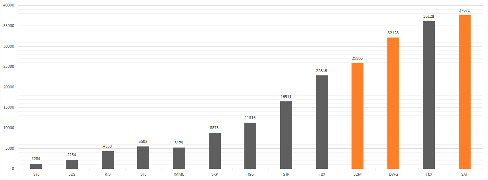
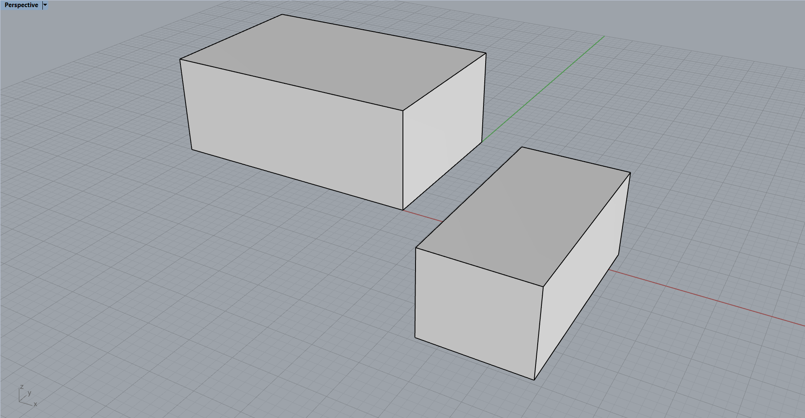

# Comparison of Rhino's 3D export formats
 
Two Boxes in 12 different formats for comparison

---

Size in bytes (less is better):

|Format|Size                         |isText|canImportBack                                |isPolysurface|isMesh|Setting              |
|------|-----------------------------|------|---------------------------------------------|-------------|------|---------------------|
|STL   |1284 B                       |no    |yes                                          |no           |yes   |Binary               |
|3DS   |2254 B                       |no    |yes                                          |no           |yes   |Default              |
|RIB   |4353 B                       |yes   |no                                           |no           |yes   |Default              |
|STL   |5502 B                       |yes   |yes                                          |no           |yes   |Ascii                |
|XAML  |5179 B                       |yes   |no                                           |no           |yes   |Default              |
|SKP   |8873 B                       |no    |yes                                          |no           |yes   |SketchUp 2013        |
|IGS   |11316 B                      |yes   |yes                                          |no           |no    |Default              |
|STP   |16511 B                      |yes   |yes                                          |yes          |no    |AP214AutomotiveDesign|
|FBX   |22846 B                      |yes   |yes                                          |no           |no    |v7 ascii             |
|3DM   |25966 B                      |no    |yes                                          |yes          |no    |Default              |
|DWG   |32128 B                      |no    |yes                                          |yes          |no    |Solids               |
|FBX   |36128 B                      |no    |yes                                          |no           |no    |v7 binary            |
|SAT   |37671 B                      |yes   |no                                           |yes          |no    |Default              |

Scene:

